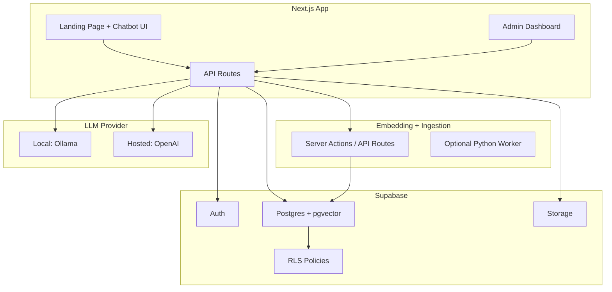

# Multi-Workspace Knowledge Base

> **A B2B-ready RAG chatbot platform where every workspace gets its own isolated documents, chat history, and AI-powered answers — powered by Next.js, Supabase, and pgvector.**

---

## Table of Contents

- [Why This Wins](#why-this-wins)
- [Features](#features)
- [How RAG Works Here](#how-rag-works-here)
- [Architecture](#architecture)
- [Tech Stack](#tech-stack)
- [Project Structure](#project-structure)
- [Database Schema](#database-schema)
- [Security](#security)
- [Setup](#setup)
- [Knowledge Base Ingestion](#knowledge-base-ingestion)
- [Chat Pipeline](#chat-pipeline)
- [Multi-Workspace Mode](#multi-workspace-mode)
- [Admin Dashboard](#admin-dashboard)
- [API Endpoints](#api-endpoints)
- [Testing](#testing)
- [Deployment](#deployment)
- [Troubleshooting](#troubleshooting)
- [Roadmap](#roadmap)
- [License](#license)

---

## Why This Wins

> This instantly feels like a **product**, not a demo.

- **Workspace switching** — Company A and Company B each get their own knowledge silo
- **Role-based access** — admin vs. member per workspace
- **RLS isolation** — users physically cannot read another workspace's docs
- **Wow demo moment:** Log in as a different user → chatbot answers differently because it sees only _that workspace's_ docs
- **$0 budget** — runs entirely on Supabase free tier + local LLM

---

## Features

### Core

- 🔐 **Authentication** — Supabase Auth with secure sessions
- 🏢 **Multi-Workspace** — isolated docs, chunks, and chat per workspace
- 📄 **Document Upload** — ingest PDFs, text, and web content
- 🧠 **RAG Pipeline** — chunk → embed → retrieve → generate grounded answers
- 💬 **Streaming Chat** — real-time token-by-token responses via SSE
- 📎 **Citations** — clickable source references under every answer
- 🛡️ **Row Level Security** — enforced at the Postgres layer

### Bonus Features

- 📊 **Admin Dashboard** — upload, monitor, and manage the knowledge base
- 💾 **Chat History** — persistent conversation memory with session management
- 🔌 **Pluggable LLM** — swap between local (Ollama) and hosted (OpenAI)
- 👥 **Workspace Roles** — admin vs. member with invitation flow

---

## How RAG Works Here

**RAG workflow implemented:**

1. User asks a question
2. Convert the question to an embedding
3. Vector search in the chunk store (filtered by `workspace_id`)
4. Retrieve top-K relevant chunks
5. Build a prompt: **question + retrieved chunks**
6. LLM generates a grounded answer
7. Return answer with citations

```
┌──────────────┐
│  User asks   │
│  a question  │
└──────┬───────┘
       ▼
┌──────────────────┐
│ Convert question │
│  to embedding    │
└──────┬───────────┘
       ▼
┌──────────────────────────────┐
│ Vector search in chunk store │
│  (filtered by workspace_id) │
└──────┬───────────────────────┘
       ▼
┌──────────────────┐
│ Retrieve top-K   │
│ relevant chunks  │
└──────┬───────────┘
       ▼
┌────────────────────────────┐
│ Build prompt:              │
│  question + retrieved      │
│  chunks                    │
└──────┬─────────────────────┘
       ▼
┌──────────────────┐
│ LLM generates a  │
│ grounded answer  │
└──────┬───────────┘
       ▼
┌──────────────────────────┐
│ Return answer            │
│ (with citations)         │
└──────────────────────────┘
```

This ensures the bot answers from **your uploaded knowledge**, not from generic guessing.

---

## Architecture

### High-Level Components

- **Next.js App (Web)**
  - Landing page + chatbot UI
  - Admin dashboard (document management)
  - API routes (chat + ingestion hooks)

- **Supabase**
  - Auth (users, sessions)
  - Postgres (workspaces, documents, chunks, embeddings, chats)
  - Storage (PDF files)
  - RLS policies (workspace isolation)

- **Embedding + Ingestion**
  - Runs as:
    - Next.js server actions / API routes **OR**
    - Supabase Edge Function **OR**
    - Optional Python worker (for robust PDF parsing)

- **LLM Provider**
  - Pluggable:
    - Local dev: Ollama / local model
    - Hosted: OpenAI / other (if keys exist later)
  - Designed to run with **$0 budget**:
    - Local inference for generation, **or**
    - "Retrieval + citations" demo without paid inference



---

## Tech Stack

| Layer                   | Technology                                                          |
| ----------------------- | ------------------------------------------------------------------- |
| **Frontend**            | Next.js (App Router), TypeScript, Tailwind CSS                      |
| **Backend**             | Next.js API Routes / Server Actions                                 |
| **Auth / DB / Storage** | Supabase                                                            |
| **Vector Search**       | Postgres + pgvector                                                 |
| **PDF Parsing**         | Lightweight JS (fast setup) _or_ Python service (robust extraction) |
| **Streaming**           | Server-Sent Events (SSE) / fetch streaming                          |

---

## Project Structure

> See [`structure.md`](./structure.md) for detailed file-by-file descriptions.

```
.
├── app/
│   ├── (auth)/
│   │   ├── login/page.tsx
│   │   └── signup/page.tsx
│   ├── (protected)/
│   │   ├── page.tsx                  # Landing page (logged in)
│   │   ├── admin/
│   │   │   ├── page.tsx              # Admin UI
│   │   │   └── documents/page.tsx
│   │   └── chat/page.tsx             # Full chat page
│   ├── api/
│   │   ├── chat/route.ts             # RAG chat endpoint (streaming)
│   │   ├── ingest/route.ts           # Trigger ingestion
│   │   └── documents/route.ts        # CRUD docs
│   └── layout.tsx
├── components/
│   ├── chatbot/
│   │   ├── ChatWidget.tsx
│   │   ├── ChatWindow.tsx
│   │   └── MessageList.tsx
│   └── admin/
│       ├── DocumentUploader.tsx
│       └── DocumentTable.tsx
├── lib/
│   ├── supabase/
│   │   ├── client.ts
│   │   └── server.ts
│   ├── rag/
│   │   ├── chunker.ts
│   │   ├── embedder.ts
│   │   ├── retriever.ts
│   │   └── prompt.ts
│   └── auth/
│       └── guards.ts
├── supabase/
│   ├── migrations/
│   └── seed.sql
├── scripts/
│   ├── ingest_site.ts
│   └── dev_seed_docs.ts
├── .env.example
├── structure.md
└── README.md
```

---

## Database Schema

### Key Design: Workspace Isolation

Every data table includes a `workspace_id` column. All queries and RLS policies filter by workspace, ensuring **Company A's docs never leak into Company B's chatbot**.

**Tables:** `workspaces` → `workspace_members` → `documents` → `document_chunks` → `chat_sessions` → `chat_messages`

---

### `workspaces`

| Column       | Type          | Description                       |
| ------------ | ------------- | --------------------------------- |
| `id`         | `uuid`        | Primary key                       |
| `name`       | `text`        | Workspace name (e.g. "Acme Corp") |
| `slug`       | `text`        | URL-safe identifier               |
| `created_by` | `uuid`        | FK → `auth.users`                 |
| `created_at` | `timestamptz` |                                   |
| `updated_at` | `timestamptz` |                                   |

### `workspace_members`

| Column         | Type          | Description          |
| -------------- | ------------- | -------------------- |
| `id`           | `uuid`        | Primary key          |
| `workspace_id` | `uuid`        | FK → `workspaces.id` |
| `user_id`      | `uuid`        | FK → `auth.users`    |
| `role`         | `text`        | `admin` · `member`   |
| `created_at`   | `timestamptz` |                      |

### `documents`

| Column         | Type          | Description                       |
| -------------- | ------------- | --------------------------------- |
| `id`           | `uuid`        | Primary key                       |
| `workspace_id` | `uuid`        | FK → `workspaces.id`              |
| `title`        | `text`        | Document title                    |
| `type`         | `text`        | `pdf` · `text` · `web`            |
| `storage_path` | `text`        | Supabase Storage path (for PDFs)  |
| `status`       | `text`        | `processing` · `ready` · `failed` |
| `created_at`   | `timestamptz` |                                   |
| `updated_at`   | `timestamptz` |                                   |

### `document_chunks`

| Column         | Type      | Description                   |
| -------------- | --------- | ----------------------------- |
| `id`           | `uuid`    | Primary key                   |
| `document_id`  | `uuid`    | FK → `documents.id`           |
| `workspace_id` | `uuid`    | FK — for direct RLS filtering |
| `chunk_index`  | `integer` | Order within document         |
| `content`      | `text`    | Chunk text                    |
| `metadata`     | `jsonb`   | Page, section, URL, etc.      |
| `embedding`    | `vector`  | pgvector embedding            |
| `is_active`    | `boolean` | Soft-disable toggle           |

### `chat_sessions`

| Column         | Type          | Description          |
| -------------- | ------------- | -------------------- |
| `id`           | `uuid`        | Primary key          |
| `workspace_id` | `uuid`        | FK → `workspaces.id` |
| `user_id`      | `uuid`        | FK → `auth.users`    |
| `title`        | `text`        | Session title        |
| `created_at`   | `timestamptz` |                      |
| `updated_at`   | `timestamptz` |                      |

### `chat_messages`

| Column       | Type          | Description             |
| ------------ | ------------- | ----------------------- |
| `id`         | `uuid`        | Primary key             |
| `session_id` | `uuid`        | FK → `chat_sessions.id` |
| `role`       | `text`        | `user` · `assistant`    |
| `content`    | `text`        | Message body            |
| `citations`  | `jsonb`       | Source references       |
| `created_at` | `timestamptz` |                         |

---

## Security

### Authentication

- Uses **Supabase Auth** (secure sessions)
- All protected pages are gated **server-side**

### Authorization

- Admin routes are restricted by **workspace role**
- Multi-workspace access is restricted by **membership** in `workspace_members`

### Row Level Security (RLS)

> **⚠️ IMPORTANT:** RLS is **mandatory** for real security. Do **not** rely only on frontend checks.

Enable RLS on all tables and enforce:

- Users can only read/write data in **workspaces they belong to**
- Users can only access documents/chunks within **their workspaces**
- Only **workspace admins** can upload/manage documents
- Workspace isolation is enforced at the DB level — no application-layer trust

---

## Setup

### 1) Prerequisites

| Requirement         | Version                           |
| ------------------- | --------------------------------- |
| Node.js             | 18+ (or 20+)                      |
| Package Manager     | pnpm / npm / yarn                 |
| Supabase CLI        | latest                            |
| Docker              | latest (for local Supabase stack) |
| Python _(optional)_ | 3.10+ (for robust PDF extraction) |

### 2) Environment Variables

Create `.env.local` (see `.env.example` for template):

```bash
# Supabase
NEXT_PUBLIC_SUPABASE_URL=...
NEXT_PUBLIC_SUPABASE_ANON_KEY=...
SUPABASE_SERVICE_ROLE_KEY=...            # server-only, NEVER expose to client

# Embeddings provider (choose one)
EMBEDDINGS_PROVIDER=local|openai|...
OPENAI_API_KEY=...                       # optional
OLLAMA_BASE_URL=http://localhost:11434   # optional

# LLM provider (choose one)
LLM_PROVIDER=local|openai|...
```

> **⚠️ CAUTION:** `SUPABASE_SERVICE_ROLE_KEY` must **never** be exposed to the client.
> For `$0` budget, prefer `LLM_PROVIDER=local` during demo/dev.

### 3) Supabase Setup (Local)

```bash
supabase init
supabase start
```

This starts local Postgres/Auth/Storage. Use the local Supabase keys in `.env.local`.

### 4) Database Migrations

```bash
supabase db reset
# or apply migrations incrementally:
supabase migration up
```

### 5) Run the App

```bash
pnpm install
pnpm dev
```

Visit:

- `/login` — sign in
- `/signup` — create account
- `/` — protected landing page (workspace switcher)
- `/admin` — admin dashboard (workspace-scoped, role-restricted)

---

## Knowledge Base Ingestion

### Document Upload Flow

1. Admin uploads a PDF / text / web content
2. Store the file (PDF) in **Supabase Storage**
3. Extract text
4. Chunk text
5. Compute embeddings per chunk
6. Store chunks + embeddings (**pgvector**) with `workspace_id`
7. Mark document `status = ready`

### Chunking Strategy

| Parameter  | Default                              |
| ---------- | ------------------------------------ |
| Chunk size | ~300–800 tokens (~1,500–3,000 chars) |
| Overlap    | 10–20%                               |

Preserved metadata per chunk:

- PDF page number
- Headings / sections
- Source URL (for web imports)

> **Goal:** keep chunks small enough for retrieval accuracy but large enough to keep context.

### Embedding Strategy

- Store embeddings in `document_chunks.embedding`
- Index with **pgvector** for similarity search
- Use **cosine similarity** or inner product

---

## Chat Pipeline

### Retrieval

Given a user question:

1. Create question embedding
2. Run similarity search in chunks filtered by:
   - `workspace_id` (**mandatory** — workspace isolation)
   - `is_active = true`
3. Take **top-K** chunks

### Prompt Composition

The prompt includes:

- **System rules** — be grounded; if unknown, say so
- **Retrieved chunks** — with source metadata
- **User question**

### Streaming Responses

- API returns a **streamed response** for real-time typing
- UI shows "typing…" indicator and token-by-token streaming

### Citations

Return citations as structured JSON:

```json
{
  "document_id": "...",
  "title": "...",
  "page": 3,
  "section": "Introduction",
  "url": "...",
  "chunk_id": "..."
}
```

UI displays clickable citations under each assistant answer.

### Conversation Memory

| Layer                      | Strategy                                            |
| -------------------------- | --------------------------------------------------- |
| **Short-term**             | Last N messages in the prompt                       |
| **Long-term** _(optional)_ | Store message history in DB, summarize old messages |

---

## Multi-Workspace Mode

### What It Adds

Multiple **isolated knowledge bases** in one platform:

- Each workspace has its own documents, chunks, and chat history
- Workspace roles and invitations (`admin` / `member`)
- Workspace switcher in UI

### How Isolation Works

- Every `document` / `chunk` / `chat` row includes `workspace_id`
- All retrieval queries filter by `workspace_id`
- RLS policies enforce membership via `workspace_members`
- Users without membership **cannot see or query** a workspace's data

### Demo Scenarios

| Workspace       | Bot answers about…              |
| --------------- | ------------------------------- |
| **Clinic**      | Clinic services, hours, doctors |
| **Real Estate** | Listings, pricing, availability |

> **Wow moment:** Same question asked in both workspaces produces **different answers** from **different sources**.

---

## Admin Dashboard

Admin capabilities (scoped to current workspace):

- ✅ Upload document
- ✅ View processing status (`processing` → `ready` → `failed`)
- ✅ Browse chunks (with metadata)
- ✅ Disable / enable chunks
- ✅ Delete document (cascades to chunks)

**Optional evaluation tools:**

- Run test questions
- Track unanswered queries
- See "missing topics"

---

## API Endpoints

| Method | Endpoint         | Body                                   | Response                    |
| ------ | ---------------- | -------------------------------------- | --------------------------- |
| `POST` | `/api/chat`      | `{ sessionId?, workspaceId, message }` | Streamed answer + citations |
| `POST` | `/api/ingest`    | `{ workspaceId, documentId }`          | Triggers ingestion pipeline |
| `POST` | `/api/documents` | Upload / create doc (workspace-scoped) | Document record             |
| `GET`  | `/api/documents` | `?workspaceId=...`                     | List docs (admin)           |

> Ingestion can run directly on upload or as an async job.

---

## Testing

### Minimum Recommended Tests

- [ ] Auth + route protection
- [ ] RLS verification — **user A cannot access workspace B docs**
- [ ] Ingestion pipeline (chunk count, status transitions)
- [ ] Retrieval sanity (top chunk matches expected doc, scoped to workspace)
- [ ] Chat endpoint streaming works
- [ ] Workspace switching produces different answers

### Suggested Tooling

| Tool              | Purpose    |
| ----------------- | ---------- |
| **Playwright**    | UI flows   |
| **Vitest / Jest** | Unit tests |

---

## Deployment

### Low-Cost / $0-ish Paths

| Service  | Tier                                          |
| -------- | --------------------------------------------- |
| Vercel   | Free tier (Next.js)                           |
| Supabase | Free tier (DB / Auth / Storage)               |
| LLM      | Local only for dev/demo (BYOK for production) |

### Production Checklist

- [ ] Turn on RLS for **all** tables
- [ ] Lock down service-role key (server-only)
- [ ] Add **rate limiting** to chat endpoint
- [ ] Add **file validation** (size / type)
- [ ] Add **monitoring / logging** for ingestion failures

---

## Troubleshooting

| Problem                                     | Solution                                                                                                                              |
| ------------------------------------------- | ------------------------------------------------------------------------------------------------------------------------------------- |
| **Chatbot answers wrong / hallucinates**    | Increase top-K retrieval; add strict system rule: "If not in sources, say you don't know"; add citations and refuse if confidence low |
| **PDF text extraction is bad**              | Add Python PDF extraction worker; store pages separately for better chunk metadata                                                    |
| **Users can access admin page**             | Fix route guards (server-side check); fix RLS + role checks                                                                           |
| **Vector search returns irrelevant chunks** | Improve chunking (smaller + overlap); add metadata filters; consider hybrid retrieval (keyword + vector)                              |
| **User sees another workspace's docs**      | Verify RLS policies on `documents`, `document_chunks`; ensure all queries include `workspace_id` filter                               |

---

## Roadmap

### Phase 1 — MVP

- [ ] Auth (login / signup)
- [ ] Workspace creation + switching
- [ ] Role-based access (admin vs member)
- [ ] Protected landing + chatbot widget
- [ ] Admin upload PDFs / text (workspace-scoped)
- [ ] Chunk + embed + vector search
- [ ] Chat streaming

### Phase 2

- [ ] Citations UI
- [ ] Chat history (per workspace)
- [ ] Workspace invitations
- [ ] Admin analytics (top questions, doc coverage)

### Phase 3

- [ ] Auto-ingest website pages (scheduled)
- [ ] Evaluation dashboard (test set)
- [ ] OAuth login
- [ ] "Chat → action" flows (lead capture, booking)

---

## License

MIT

---

## Competition Demo Tips

> 💡 **Tips for winning demos:**
>
> - Show **"Sources"** under every answer — trust wins
> - Demo admin upload → `processing` → `ready` transition
> - Ask 2–3 questions that clearly demonstrate retrieval from docs
> - **Log in as a different user** → chatbot answers differently because it sees only that workspace's docs
> - Show workspace switching producing **isolated, different answers**
