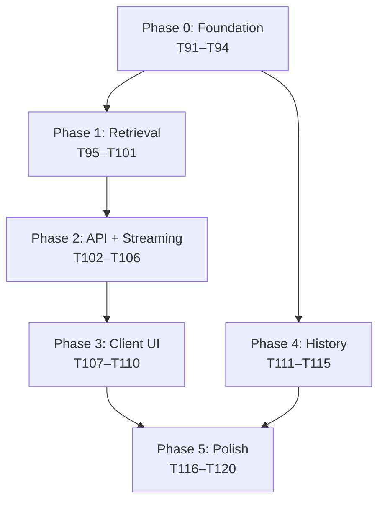

# Tasks: Batch 4 — Chat Backend

**Input**: [spec.md](file:///home/dawa/Documents/CSEC/specs/004-batch-4-chat/spec.md) · [plan.md](file:///home/dawa/Documents/CSEC/specs/004-batch-4-chat/plan.md)
**Branch**: `004-batch-4-chat`
**IDs**: 91–120 (30 tasks)

---

## Phase 0: Foundation (Setup & Shared Infrastructure)

> **Blocks all subsequent phases.** Types, migrations, and test framework must land first.

- [ ] **91** [P] Define shared RAG types in `src/lib/rag/types.ts`
  - **Goal**: Central type definitions (`RetrievedChunk`, `Citation`, `ChatRequest`, `SSEEvent`, etc.)
  - **Done when**: Types compile and are importable from other modules
  - **Files**: `src/lib/rag/types.ts` [NEW]

- [ ] **92** [P] Create `match_chunks` pgvector RPC migration
  - **Goal**: SQL function for cosine-similarity search with doc-status/enabled filters
  - **Done when**: `SELECT * FROM match_chunks(embedding, 5, 0.35)` returns ranked chunks on hosted Supabase
  - **Files**: `supabase/migrations/20260213100000_match_chunks_rpc.sql` [NEW]

- [ ] **93** [P] Create chat history tables migration (`chat_sessions`, `chat_messages`)
  - **Goal**: Persist sessions and messages with RLS scoped to `auth.uid()`
  - **Done when**: Tables + RLS policies created; user can only read/write own data
  - **Files**: `supabase/migrations/20260213200000_chat_history.sql` [NEW]

- [ ] **94** [P] Configure Vitest + global Supabase mock
  - **Goal**: Test framework with path aliases and a shared mock for `@supabase/supabase-js`
  - **Done when**: `pnpm test` runs a trivial passing test; Supabase calls are interceptable
  - **Files**: `vitest.config.ts` [NEW], `__tests__/setup.ts` [NEW], `package.json` [MODIFY]

**Checkpoint**: Foundation ready — retrieval and API work can begin.

---

## Phase 1: Retrieval Pipeline (Server-Side)

> Depends on: Phase 0 (types, `match_chunks` RPC)

- [ ] **95** Implement `matchChunks()` retriever in `src/lib/rag/retriever.ts`
  - **Goal**: Call Supabase `match_chunks` RPC and return typed `RetrievedChunk[]`
  - **Done when**: Given a sample embedding, returns top-K chunks from hosted DB
  - **Files**: `src/lib/rag/retriever.ts` [MODIFY — currently empty]

- [ ] **96** Add retrieval filters (exclude disabled/non-ready docs)
  - **Goal**: `match_chunks` SQL already filters; verify retriever never returns disabled content
  - **Done when**: Disabled document's chunks are absent from results
  - **Files**: `src/lib/rag/retriever.ts` [MODIFY]

- [ ] **97** Add retrieval metadata shaping (doc title, page, section, url)
  - **Goal**: Each `RetrievedChunk` carries full citation metadata from the JOIN
  - **Done when**: Chunks include `document_title`, `page`, `section`, `url` ready for UI
  - **Files**: `src/lib/rag/retriever.ts` [MODIFY]

- [ ] **98** Implement evidence threshold check in `src/lib/rag/evidence.ts`
  - **Goal**: Determine if retrieval results are strong enough to answer
  - **Done when**: Returns `pass: true` with qualifying chunks OR `pass: false` with refusal payload
  - **Files**: `src/lib/rag/evidence.ts` [NEW]

- [ ] **99** Implement refusal response template
  - **Goal**: Structured refusal message with suggestions when evidence is insufficient
  - **Done when**: Refusal includes `type: 'refusal'`, human-friendly message, and `suggestions[]`
  - **Files**: `src/lib/rag/evidence.ts` [MODIFY]

- [ ] **100** Implement extractive answer formatter in `src/lib/rag/prompt.ts`
  - **Goal**: Select best passages from qualifying chunks, format as ≤ 3-sentence answer
  - **Done when**: Output contains concise extractive text derived from chunk content
  - **Files**: `src/lib/rag/prompt.ts` [MODIFY — currently empty]

- [ ] **101** Add citations formatting to answer output
  - **Goal**: Append structured `Sources:` block with doc title / page / section / url per chunk
  - **Done when**: `formatExtractiveAnswer()` returns `{ text, citations: Citation[] }`
  - **Files**: `src/lib/rag/prompt.ts` [MODIFY]

---

## Phase 2: API Route, Auth, Streaming

> Depends on: Phase 1 (retriever, evidence, formatter)

- [ ] **102** Create `/api/chat` POST route with input validation
  - **Goal**: Accept `{ embedding, message, message_id, session_id? }`, validate shape
  - **Done when**: Route responds `400` for malformed input, `200` scaffold for valid input
  - **Files**: `src/app/api/chat/route.ts` [MODIFY — replace placeholder GET]

- [ ] **103** Enforce auth on `/api/chat`
  - **Goal**: Only authenticated users can call the endpoint
  - **Done when**: Unauthenticated requests receive `401`; authenticated requests proceed
  - **Files**: `src/app/api/chat/route.ts` [MODIFY]

- [ ] **104** Add SSE streaming response protocol
  - **Goal**: Stream `answer_start → answer_delta(s) → sources → answer_end` via `text/event-stream`
  - **Done when**: Client receives incremental SSE events for a valid question
  - **Files**: `src/app/api/chat/route.ts` [MODIFY]

- [ ] **105** Add message ID deduplication
  - **Goal**: Reject duplicate `message_id` to prevent double-sends on retry
  - **Done when**: Same `message_id` sent twice produces only one stored response
  - **Files**: `src/app/api/chat/route.ts` [MODIFY], `src/lib/chat/messages.ts` [NEW]

- [ ] **106** Implement rate limiter in `src/lib/chat/rate-limit.ts`
  - **Goal**: Sliding-window limit (20 req/min/user) with `429` + `Retry-After`
  - **Done when**: 21st request within 1 minute returns `429` with friendly message
  - **Files**: `src/lib/chat/rate-limit.ts` [NEW], `src/app/api/chat/route.ts` [MODIFY]

---

## Phase 3: Client-Side Embedding & UI Wiring

> Depends on: Phase 2 (working `/api/chat` with SSE)

- [ ] **107** Add `embedQuestion()` with 15s timeout in `src/lib/rag/embedder.ts`
  - **Goal**: Wrapper returning `number[384]` with specific failure modes (timeout, unsupported)
  - **Done when**: 15s passes without load produces `ERR_LOAD_TIMEOUT`; vectors returned on success
  - **Files**: `src/lib/rag/embedder.ts` [MODIFY]

- [ ] **108** Wire chat widget to `/api/chat` with real SSE
  - **Goal**: Replace mock `simulateStream()` with `embedQuestion()` → fetch → SSE parse
  - **Done when**: Typing a question in the widget produces a real retrieval-backed streamed answer
  - **Files**: `src/components/chat/chat-widget.tsx` [MODIFY]

- [ ] **109** Add citations rendering to chat UI
  - **Goal**: Display clickable citation cards below each assistant message
  - **Done when**: Sources from `sources` SSE event render with title, page, section
  - **Files**: `src/components/chat/citation.tsx` [MODIFY]

- [ ] **110** Add safe markdown rendering to message bubbles
  - **Goal**: Sanitize chunk-derived content; render bold/italic/lists safely
  - **Done when**: `<script>` tags in content are stripped; markdown renders correctly
  - **Files**: `src/lib/sanitize.ts` [NEW], `src/components/chat/message-bubble.tsx` [MODIFY]

---

## Phase 4: Chat History Persistence

> Depends on: Phase 0 (chat history migration), Phase 2 (working route)

- [ ] **111** Implement session creation logic in `src/lib/chat/session.ts`
  - **Goal**: Create `chat_sessions` row on first message; return existing session if ID provided
  - **Done when**: New session created with auto-title; existing session touched on reuse
  - **Files**: `src/lib/chat/session.ts` [NEW]

- [ ] **112** Store user and assistant messages in `chat_messages`
  - **Goal**: Persist both roles with content and citations JSONB per turn
  - **Done when**: After a chat exchange, both user + assistant rows exist in DB
  - **Files**: `src/lib/chat/messages.ts` [MODIFY]

- [ ] **113** Add chat history list UI
  - **Goal**: Show user's past sessions ordered by last activity
  - **Done when**: Sessions list renders in reverse chronological order with titles
  - **Files**: `src/components/chat/chat-history.tsx` [NEW]

- [ ] **114** Add resume conversation
  - **Goal**: Click a past session → load messages → continue chatting
  - **Done when**: Old messages and citations restore; new messages append to same session
  - **Files**: `src/components/chat/chat-widget.tsx` [MODIFY], `src/components/chat/chat-history.tsx` [MODIFY]

- [ ] **115** Add session title generation (simple)
  - **Goal**: Auto-title from first message (first 80 chars, word boundary, `…`)
  - **Done when**: New sessions have readable, truncated titles
  - **Files**: `src/lib/chat/session.ts` [MODIFY]

---

## Phase 5: Polish, Optional Features & Testing

> Depends on: Phases 1–4

- [ ] **116** [P] Add "show more sources" expansion toggle
  - **Goal**: When > 3 citations, collapse extras behind a toggle
  - **Done when**: Toggle reveals/hides additional citations
  - **Files**: `src/components/chat/citation.tsx` [MODIFY]

- [ ] **117** [P] Add "copy answer" button
  - **Goal**: Copy assistant answer (plain text, no markup) to clipboard
  - **Done when**: Click copies text; icon shows checkmark feedback for 2s
  - **Files**: `src/components/chat/copy-button.tsx` [NEW]

- [ ] **118** Add prompt-style generation mode (optional)
  - **Goal**: Alternative answering mode using small Transformers.js text-generation model
  - **Done when**: When `CHAT_ANSWER_MODE=generative`, fuller answers generated from context
  - **Files**: `src/lib/rag/prompt.ts` [MODIFY]

- [ ] **119** Add generation mode toggle
  - **Goal**: Admin/env-controlled switch between extractive and small-model modes
  - **Done when**: Toggle exists; default remains extractive; switching works without errors
  - **Files**: `src/app/api/chat/route.ts` [MODIFY]

- [ ] **120** Add error mapping + final polish
  - **Goal**: Map `ERR_WASM_UNSUPPORTED`, `ERR_LOAD_TIMEOUT`, 401, 429, 500 to user-friendly chat messages
  - **Done when**: Every failure state shows a clear, actionable message; layout is stable
  - **Files**: `src/components/chat/chat-widget.tsx` [MODIFY], `src/app/api/chat/route.ts` [MODIFY]

---

## Dependencies & Execution Order



### Parallel Opportunities

| Tasks           | Can Parallel? | Why                                |
| --------------- | ------------- | ---------------------------------- |
| 91, 92, 93, 94  | ✅ Yes [P]    | Different files, no deps           |
| 95 → 96 → 97    | ❌ Sequential | Each extends retriever             |
| 98, 99          | ❌ Sequential | Refusal depends on threshold check |
| 100, 101        | ❌ Sequential | Citations extend formatter         |
| 102 → 103 → 104 | ❌ Sequential | Route is built incrementally       |
| 107 → 108       | ❌ Sequential | Widget needs embedder helper       |
| 111, 112        | ❌ Sequential | Messages need session              |
| 116, 117        | ✅ Yes [P]    | Different UI components            |
| 118, 119        | ❌ Sequential | Toggle needs generation mode       |

---

## tasks.json

```json
[
  {
    "id": 91,
    "title": "Define shared RAG types",
    "goal": "Central TypeScript types for RetrievedChunk, Citation, ChatRequest, SSEEvent",
    "done_when": "Types compile and are importable from other modules"
  },
  {
    "id": 92,
    "title": "Create match_chunks pgvector RPC migration",
    "goal": "SQL function for cosine-similarity search with doc-status/enabled filters",
    "done_when": "match_chunks(embedding, 5, 0.35) returns ranked chunks on hosted Supabase"
  },
  {
    "id": 93,
    "title": "Create chat history tables migration",
    "goal": "chat_sessions + chat_messages tables with RLS scoped to auth.uid()",
    "done_when": "Tables + RLS policies created; user can only read/write own data"
  },
  {
    "id": 94,
    "title": "Configure Vitest + global Supabase mock",
    "goal": "Test framework with path aliases and shared Supabase mock",
    "done_when": "pnpm test runs a trivial passing test; Supabase calls interceptable"
  },
  {
    "id": 95,
    "title": "Implement retrieval SQL query",
    "goal": "Call Supabase match_chunks RPC and return typed RetrievedChunk[]",
    "done_when": "Top chunks returned for known question embedding"
  },
  {
    "id": 96,
    "title": "Add retrieval filters",
    "goal": "Exclude disabled/non-ready documents from retrieval results",
    "done_when": "Disabled content never appears in results"
  },
  {
    "id": 97,
    "title": "Add retrieval metadata shaping",
    "goal": "Return doc title/page/section/url for citations in each chunk",
    "done_when": "Chat UI can display sources from retriever output"
  },
  {
    "id": 98,
    "title": "Implement evidence check",
    "goal": "Detect low similarity or empty retrieval",
    "done_when": "System triggers 'not enough info' behavior when max score < threshold"
  },
  {
    "id": 99,
    "title": "Implement refusal response template",
    "goal": "Standard grounded refusal with suggestions when evidence missing",
    "done_when": "Bot refuses with structured message when evidence insufficient"
  },
  {
    "id": 100,
    "title": "Implement extractive answering",
    "goal": "Generate concise answer from retrieved chunks (≤ 3 sentences)",
    "done_when": "Answers are fast and derived from chunk content"
  },
  {
    "id": 101,
    "title": "Add answer formatting + citations block",
    "goal": "Append Sources: block with doc title/page/section per chunk",
    "done_when": "formatExtractiveAnswer() returns { text, citations[] }"
  },
  {
    "id": 102,
    "title": "Create /api/chat POST route with validation",
    "goal": "Chat endpoint that accepts { embedding, message, message_id, session_id? }",
    "done_when": "Endpoint validates input; rejects malformed requests with 400"
  },
  {
    "id": 103,
    "title": "Enforce auth on /api/chat",
    "goal": "Only logged-in users can chat",
    "done_when": "Unauthed calls rejected with 401"
  },
  {
    "id": 104,
    "title": "Add streaming response protocol",
    "goal": "Stream answer_start → answer_delta(s) → sources → answer_end via SSE",
    "done_when": "UI shows incremental assistant response via EventStream"
  },
  {
    "id": 105,
    "title": "Add message ID deduplication",
    "goal": "Prevent double-sends on network retry",
    "done_when": "Duplicate messages are not created"
  },
  {
    "id": 106,
    "title": "Add rate limit (basic)",
    "goal": "Protect endpoint from spam (20 req/min/user)",
    "done_when": "Burst requests are limited with friendly 429 error"
  },
  {
    "id": 107,
    "title": "Create question embedding utility",
    "goal": "Convenience embedQuestion() wrapper returning number[384]",
    "done_when": "Embedding vector returned for sample question"
  },
  {
    "id": 108,
    "title": "Wire chat widget to /api/chat",
    "goal": "Replace mock streaming with real embed → fetch → SSE parse flow",
    "done_when": "Chat works end-to-end with retrieval"
  },
  {
    "id": 109,
    "title": "Add citations rendering",
    "goal": "Render clickable citation cards per assistant message",
    "done_when": "Sources render under assistant answers with title/page/section"
  },
  {
    "id": 110,
    "title": "Add safe markdown rendering rules",
    "goal": "Sanitize chunk content; strip scripts/unsafe HTML",
    "done_when": "Rendered content is sanitized; safe markdown displays correctly"
  },
  {
    "id": 111,
    "title": "Create chat_sessions creation logic",
    "goal": "Create session on first message; return existing on reuse",
    "done_when": "Session row created for first chat"
  },
  {
    "id": 112,
    "title": "Store chat_messages rows",
    "goal": "Persist user/assistant messages with citations JSONB",
    "done_when": "Chat history stored for a session"
  },
  {
    "id": 113,
    "title": "Add chat history list UI",
    "goal": "User can view past sessions in reverse chronological order",
    "done_when": "Sessions list page works"
  },
  {
    "id": 114,
    "title": "Add resume conversation",
    "goal": "Open past session and continue chatting",
    "done_when": "Messages load and new messages append to same session"
  },
  {
    "id": 115,
    "title": "Add session title generation (simple)",
    "goal": "Auto-title sessions from first message (80 chars, word boundary)",
    "done_when": "Session has readable truncated title"
  },
  {
    "id": 116,
    "title": "Add 'show more sources' expansion",
    "goal": "Toggle to reveal additional citations when > 3",
    "done_when": "User can expand citations list"
  },
  {
    "id": 117,
    "title": "Add 'copy answer' UX",
    "goal": "Quick copy button for assistant answers",
    "done_when": "Copy button works reliably with visual feedback"
  },
  {
    "id": 118,
    "title": "Add prompt-style generation (optional)",
    "goal": "Alternative small-model generation via Transformers.js",
    "done_when": "Optional mode generates fuller responses from context"
  },
  {
    "id": 119,
    "title": "Add generation mode toggle",
    "goal": "Switch between extractive vs small-model (admin/env controlled)",
    "done_when": "Toggle exists; default remains extractive"
  },
  {
    "id": 120,
    "title": "Chat polish pass",
    "goal": "Error mapping, smooth transitions, layout-shift fixes, latency optimization",
    "done_when": "Chat feels smooth and reliable; all errors show actionable messages"
  }
]
```
