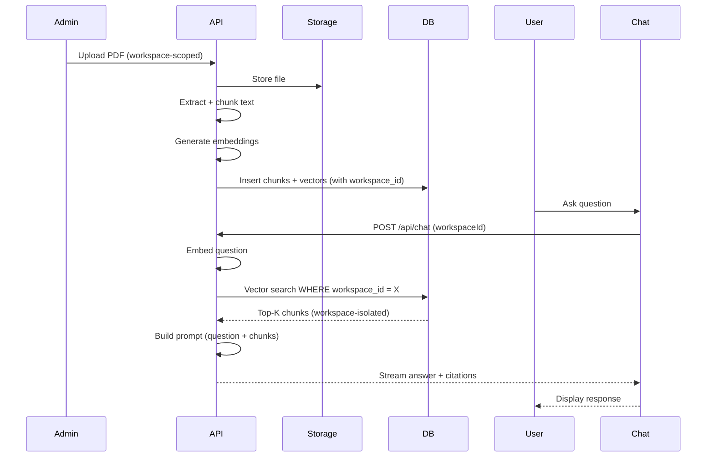

# Multi-Workspace Knowledge Base — Project Structure

> Detailed breakdown of every directory and file in the project.

---

## Root Directory

```
.
├── app/                  # Next.js App Router pages and API routes
├── components/           # Reusable React components
├── lib/                  # Shared libraries and utilities
├── supabase/             # Supabase config, migrations, and seed data
├── scripts/              # Developer scripts (seeding, scraping)
├── public/               # Static assets (favicon, images)
├── .env.example          # Template for environment variables
├── .env.local            # Actual env vars (gitignored)
├── next.config.ts        # Next.js configuration
├── tsconfig.json         # TypeScript configuration
├── tailwind.config.ts    # Tailwind CSS configuration
├── postcss.config.mjs    # PostCSS configuration
├── package.json          # Dependencies and scripts
├── structure.md          # This file
└── README.md             # Project documentation
```

---

## `app/` — Pages & Routes

Next.js App Router structure. Route groups `(auth)` and `(protected)` segment layouts.

```
app/
├── layout.tsx                        # Root layout (fonts, providers, metadata)
│
├── (auth)/                           # Public auth pages (no session required)
│   ├── login/
│   │   └── page.tsx                  # Login form (email/password via Supabase Auth)
│   └── signup/
│       └── page.tsx                  # Signup form
│
├── (protected)/                      # Authenticated pages (session required)
│   ├── page.tsx                      # Landing page — workspace switcher + chatbot
│   ├── admin/
│   │   ├── page.tsx                  # Admin dashboard (workspace-scoped)
│   │   └── documents/
│   │       └── page.tsx              # Document management (upload, status, delete)
│   └── chat/
│       └── page.tsx                  # Full-page chat view
│
└── api/                              # API route handlers
    ├── chat/
    │   └── route.ts                  # POST — RAG chat (streaming, workspace-scoped)
    ├── ingest/
    │   └── route.ts                  # POST — trigger document ingestion pipeline
    └── documents/
        └── route.ts                  # POST/GET — create/list documents
```

| Route Group   | Purpose           | Auth Required           |
| ------------- | ----------------- | ----------------------- |
| `(auth)`      | Login / signup    | No                      |
| `(protected)` | All app pages     | Yes (server-side guard) |
| `api/`        | Backend endpoints | Varies (token-based)    |

---

## `components/` — UI Components

```
components/
├── chatbot/
│   ├── ChatWidget.tsx                # Floating chatbot widget (bottom-right)
│   ├── ChatWindow.tsx                # Full chat window with input + messages
│   └── MessageList.tsx               # Message list with citation links
│
└── admin/
    ├── DocumentUploader.tsx          # Drag-and-drop upload with status indicator
    └── DocumentTable.tsx             # Document list table with status badges
```

---

## `lib/` — Shared Libraries

Core logic separated from UI. Each sub-directory is a domain module.

```
lib/
├── supabase/
│   ├── client.ts                     # Browser-side Supabase client (anon key)
│   └── server.ts                     # Server-side Supabase client (service-role key)
│
├── rag/
│   ├── chunker.ts                    # Split documents into overlapping text chunks
│   ├── embedder.ts                   # Generate vector embeddings (local or OpenAI)
│   ├── retriever.ts                  # Vector similarity search via pgvector
│   └── prompt.ts                     # Build LLM prompt from question + chunks
│
└── auth/
    └── guards.ts                     # Server-side auth checks + workspace role enforcement
```

### `lib/rag/` Pipeline Flow

```
chunker.ts → embedder.ts → retriever.ts → prompt.ts
   │              │              │              │
   │              │              │              └── Build final prompt
   │              │              └── Vector search (top-K, workspace-scoped)
   │              └── Generate embeddings
   └── Split text into chunks
```

---

## `supabase/` — Database & Config

```
supabase/
├── config.toml                       # Supabase CLI project configuration
├── migrations/
│   └── YYYYMMDDHHMMSS_*.sql          # Versioned SQL migrations
└── seed.sql                          # Seed data for local development
```

### Expected Migrations

| Migration                 | Purpose                                    |
| ------------------------- | ------------------------------------------ |
| `*_create_workspaces.sql` | `workspaces` + `workspace_members` tables  |
| `*_create_documents.sql`  | `documents` table with status enum         |
| `*_create_chunks.sql`     | `document_chunks` with `vector` column     |
| `*_create_chat.sql`       | `chat_sessions` + `chat_messages` tables   |
| `*_enable_rls.sql`        | RLS policies enforcing workspace isolation |
| `*_create_indexes.sql`    | pgvector indexes for similarity search     |

---

## `scripts/` — Developer Utilities

```
scripts/
├── ingest_site.ts                    # Scrape/import web pages into a workspace
└── dev_seed_docs.ts                  # Seed demo workspaces + documents
```

---

## Configuration Files

| File                 | Purpose                             |
| -------------------- | ----------------------------------- |
| `.env.example`       | Template with all required env vars |
| `.env.local`         | Actual values (gitignored)          |
| `next.config.ts`     | Next.js config                      |
| `tsconfig.json`      | TypeScript compiler options         |
| `tailwind.config.ts` | Tailwind theme + content paths      |
| `postcss.config.mjs` | PostCSS setup for Tailwind          |
| `package.json`       | Dependencies + scripts              |

---

## Key Data Flow


